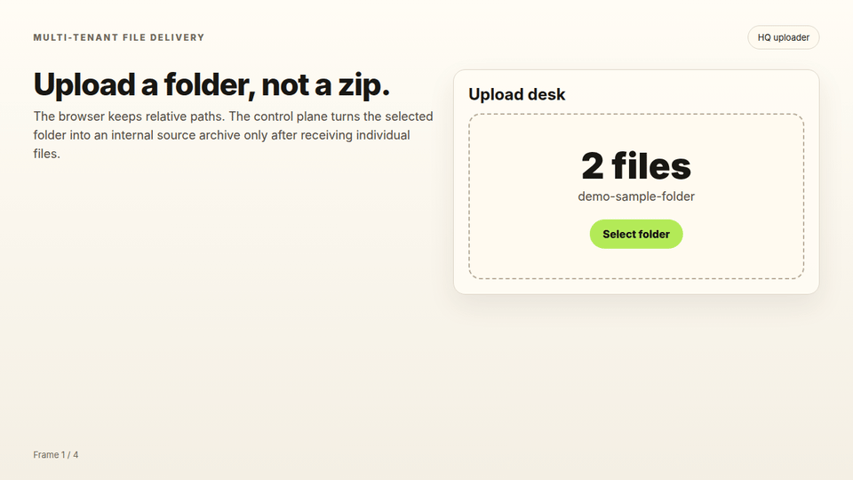
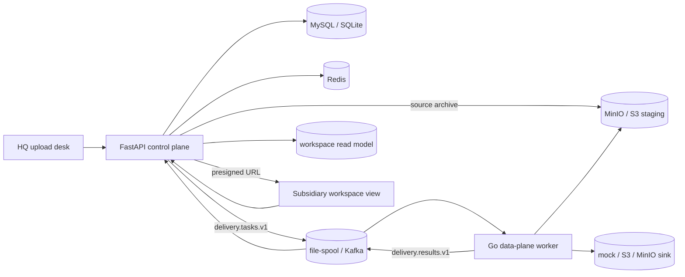

<div align="center">

### Multi-Tenant File Delivery Platform

English / [中文](README_ZH.md)

[Docs](docs/) · [Roadmap](docs/ROADMAP.md) · [Architecture](docs/ARCHITECTURE.md) · [Changelog](CHANGELOG.md)

[](control-plane/pyproject.toml)
[](data-plane/go.mod)
[](docs/ROADMAP.md)
[](LICENSE)

</div>

***

## Overview

Headquarters-to-subsidiary file distribution is a common operational workflow, but it is usually handled by tools that only solve fragments of the problem: shared drives, chat attachments, spreadsheets, object-storage consoles, MFT jobs, or one-off scripts. They can move files, but they do not own the business workflow around folder intake, classification, delivery confirmation, recipient visibility, and operational evidence.

The missing product shape is narrow but important: an HQ user selects a folder, the platform preserves relative paths, classifies each file against business profiles, previews the distribution plan before delivery, executes the transfer through a recoverable worker path, and exposes only the resulting workspace to each recipient tenant. Existing document-management, object-storage, MFT, and ETL products solve adjacent slices; this repository focuses on the end-to-end product that is absent between them.

This repository builds that product slice as a local-first, public-reference implementation of a **multi-tenant file delivery platform**. HQ users upload a folder, the control plane classifies files into subsidiary workspaces, the Go data plane delivers bytes to S3-compatible object storage, and subsidiaries can only browse and download files that belong to their own workspace.

### Product Gap

The design starts from practical constraints rather than from an infrastructure catalog:

- **The input is a business folder.** Operators should not be asked to build a zip package or model the batch as an integration payload before upload.
- **Routing rules need review.** Target company, document type, destination path, warnings, and blocking errors must be visible before delivery.
- **Delivery cannot depend on the browser.** Large batches need durable task/result handoff, retries, and result application after the API request is gone.
- **Recipients need a product view.** A subsidiary should open its workspace, not log into a bucket and rely on backend ACLs as the user experience.
- **Operations need evidence.** Progress, failures, traces, metrics, and audit events must explain what moved, where it went, and why it failed.

### What this implementation proves

- **HQ upload desk**: browser folder selection, multipart upload, classification preview, confirmation, retry, and SSE progress.
- **Python control plane**: FastAPI, SQLAlchemy, Alembic, task state, tenant-aware repositories, result application, and presigned download authorization.
- **Go data plane**: worker pipeline, file/object source resolvers, file-spool and Kafka transports, mock and S3/MinIO sinks, Redis limiter, metrics, and tracing.
- **Workspace read model**: `workspace`, `physical_object`, and `workspace_object` metadata built from delivery results.
- **Local infrastructure**: Docker Compose for MySQL, Kafka, MinIO, Redis, OTel Collector, Prometheus, and Grafana.
- **Traceable design history**: PRD, RFCs, ADRs, data model, phase plans, and release roadmap.

***

## Status

The public `main` branch is ready for the first public tag, **v0.1.0**, after Phase 6.5:

- Phase 0-6.5 implementation, audit hardening, public docs, MIT license, and demo media are on `main`.
- Release smoke has passed locally; cut the annotated tag after this final README review.
- Phase 7 is next: more sink adapters, failure-injection sinks, benchmark data, and the first dedup / credential-hardening split.

See [CHANGELOG.md](CHANGELOG.md) and [docs/ROADMAP.md](docs/ROADMAP.md).

***

## Demo



The GIF is generated from the local static UI flow. To regenerate it after UI changes:

```bash
./examples/demo.sh
```

The script creates a small sample folder, renders HQ upload and subsidiary workspace screens in headless Chrome, and writes `docs/media/demo.gif`.

***

## Feature Matrix

| Area | Current slice |
|---|---|
| Folder upload | Browser folder picker sends individual files as `multipart/form-data` field `files`; no user-facing zip upload channel. |
| Classification | Profile-driven target and document-type matching with preview, warnings, blocking errors, and persisted task items. |
| Control/data bridge | `delivery.tasks.v1` and `delivery.results.v1` contracts over local file-spool or Kafka. |
| Source reference | Control plane can stage the internal source archive to MinIO/S3; Go worker can read item bytes by object source reference. |
| Sink | Mock sink and S3/MinIO single-part PUT. Multipart/resume and additional sinks are Phase 7+. |
| Redis | Progress pub/sub, short-TTL idempotency guard, result-apply lease, and Go worker fixed-window limiter. |
| Observability | Prometheus metrics and W3C `traceparent` propagation from Python publish to Go processing/upload/result publish. |
| Multi-tenancy | Dev actor headers, tenant/user ownership, repository tenant filters, role-derived workspace access scope. |
| Workspace read view | Subsidiary/HQ workspace listing, object listing, object detail, short-TTL presigned download URL, and minimal static page. |

***

## Quick Start

### 1. Start local dependencies

```bash
cd deploy
docker compose up -d mysql kafka minio minio-init redis otel-collector prometheus grafana
```

### 2. Prepare the control plane

```bash
cd ../control-plane
uv sync --dev
cp .env.example .env
.venv/bin/python -m alembic upgrade head
```

### 3. Run the API

```bash
METRICS_ENABLED=true OBSERVABILITY_ENABLED=true \
  .venv/bin/uvicorn app.main:app --host 0.0.0.0 --port 8000
```

### 4. Run the worker

```bash
cd ../data-plane
GOTOOLCHAIN=auto GOCACHE=/tmp/smh_go_cache go run ./cmd/worker \
  -transport file \
  -source-mode file \
  -sink mock \
  -metrics-enabled \
  -startup-check=false
```

### 5. Open the UI

Serve `web/public` together with `web/css` and `web/js`, proxying `/api/v1` to the control-plane API:

- HQ upload desk: `web/public/index.html`
- Subsidiary workspace view: `web/public/workspaces.html`

For component-specific setup, see [control-plane/README.md](control-plane/README.md), [data-plane/README.md](data-plane/README.md), [web/README.md](web/README.md), and [deploy/README.md](deploy/README.md).

***

## Architecture



One sentence: the Python control plane owns business truth, tenant boundaries, task state, and read authorization; the Go data plane owns byte movement, source/sink protocol adaptation, and worker-side execution telemetry.

***

## Key Invariants

- `DELIVERY_BACKEND=go-worker` is the default minimal complete platform path; the Python uploader is legacy compatibility and does not build the workspace read model.
- Folder upload is the only public upload mode; the browser sends selected folder files directly, while the control plane may build an internal archive for source staging.
- HQ workspace access is derived from actor role and owner scope, not from special-casing `tenant_id == "hq"`.
- Subsidiary workspace access is filtered by `workspace.target_tenant_id == actor.tenant_id`; unauthorized object reads return 404.
- `workspace_object.task_id` and `workspace_object.task_item_id` are required, and `task_item_id` is unique for idempotent result application.
- Presigned download URLs are only minted after workspace/object authorization succeeds.
- Redis does not replace Kafka; it supports ephemeral progress, short-TTL idempotency, leases, and rate limiting.

***

## Documentation

| Document | Purpose |
|---|---|
| [docs/PRD.md](docs/PRD.md) | Product scope, users, non-goals, and success criteria. |
| [docs/ARCHITECTURE.md](docs/ARCHITECTURE.md) | Current architecture, write/read paths, observability topology, and invariants. |
| [docs/DATA_MODEL.md](docs/DATA_MODEL.md) | Database entities, constraints, and migration notes. |
| [docs/ROADMAP.md](docs/ROADMAP.md) | Release/tag strategy, completed phases, next phase, and deferred work. |
| [docs/RFC/](docs/RFC/) | Reviewed technical proposals. |
| [docs/ADR/](docs/ADR/) | Accepted architecture decisions. |
| [docs/plans/](docs/plans/) | Phase execution plans and acceptance records. |
| [docs/CONTRIBUTING.md](docs/CONTRIBUTING.md) | Contribution, documentation, PR, and verification rules. |

***

## Development Checks

```bash
cd control-plane
.venv/bin/python -m ruff check .
.venv/bin/python -m pytest

cd ../data-plane
GOTOOLCHAIN=auto GOCACHE=/tmp/smh_go_cache go test ./...
```

Docker opt-in tests use `RUN_DOCKER_TESTS=1`; MySQL-specific tests use `RUN_MYSQL_TESTS=1`.

***

## Repository Layout

```text
.
├── control-plane/   Python FastAPI control plane
├── data-plane/      Go worker, transport, source, sink, limiter, metrics, tracing
├── web/             Static HQ upload and subsidiary workspace UI
├── deploy/          Docker Compose, Prometheus, Grafana, OTel Collector
├── profiles/        Classification profiles
├── docs/            PRD, architecture, roadmap, RFCs, ADRs, plans
├── examples/        Demo helpers
└── proto/           Reserved cross-language contract area
```

***

## License

This project is licensed under the [MIT License](LICENSE).
