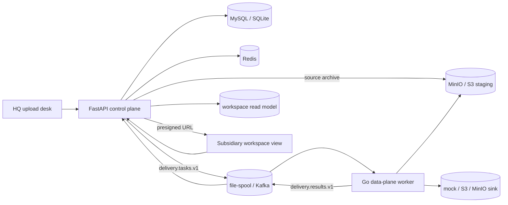

# 多租户文件分发与观测平台

[English](README.md) / 中文

[文档](docs/) · [路线图](docs/ROADMAP.md) · [架构](docs/ARCHITECTURE.md) · [变更日志](CHANGELOG.md)

***

## 概览

这是一个面向公开展示的多租户文件分发平台实现：HQ 用户选择文件夹上传，控制面按 profile 分类到各子公司 workspace，Go 数据面把文件投递到 S3 / MinIO 等对象存储，子公司只能浏览和下载属于自己的文件。

### 为什么需要它

总部到子公司的文件分发在真实场景里不只是“传几个文件”：

- **用户选择的是文件夹**：平台需要保留相对路径，不要求用户先打包 zip。
- **分类需要可解释**：正式投递前要看到接收方、文档类型、目标路径、警告和阻断错误。
- **上传执行要可恢复**：大批量文件不能依赖浏览器或 API 进程持续搬运字节，需要 durable task/result bridge。
- **租户隔离要由平台负责**：子公司可见性不能依赖某个 sink 自己的 ACL。
- **进度和失败要可观测**：Redis、Kafka、OpenTelemetry、Prometheus、Grafana 分别承担短状态、durable 消息和观测闭环。

### 当前能力

- **HQ 上传台**：文件夹选择、multipart 上传、分类预览、确认、重试和 SSE 进度。
- **Python 控制面**：FastAPI、SQLAlchemy、Alembic、任务状态、租户过滤、result apply、下载授权。
- **Go 数据面**：worker pipeline、file/object source、file-spool/Kafka transport、mock/S3 sink、Redis limiter、metrics、tracing。
- **Workspace 读模型**：`workspace`、`physical_object`、`workspace_object` 由 delivery result apply 生成。
- **本地依赖栈**：MySQL、Kafka、MinIO、Redis、OTel Collector、Prometheus、Grafana。
- **设计记录**：PRD、RFC、ADR、数据模型、阶段计划、路线图。

***

## 当前状态

当前正在准备第一个公开 release candidate：**v0.1.0**。

- Phase 0-6.5 已完成。
- tag 应打在 audit hardening 分支合并到 `main`、公开文档完成、demo GIF 生成、tag 前 smoke 通过之后。
- 下一阶段 Phase 7：扩展 sink、异常 sink、压测数据，以及 dedup / credential hardening 的拆分设计。

详见 [CHANGELOG.md](CHANGELOG.md) 和 [docs/ROADMAP.md](docs/ROADMAP.md)。

***

## Demo


重新生成 demo GIF：

```bash
./examples/demo.sh
```

脚本会创建一个小样例文件夹，使用 headless Chrome 渲染 HQ 上传台和子公司 workspace 视图，并输出 `docs/media/demo.gif`。

***

## 功能矩阵

| 能力 | 当前状态 |
|---|---|
| 文件夹上传 | 浏览器文件夹选择，以 `multipart/form-data` 的 `files` 字段提交多个文件；不保留用户侧 zip 上传通道。 |
| 分类 | Profile 驱动 target / document type 匹配，支持预览、警告、阻断错误和持久化 task item。 |
| 控制面 / 数据面桥接 | `delivery.tasks.v1` / `delivery.results.v1`，支持 file-spool 和 Kafka。 |
| Source reference | 控制面可把内部 source archive 暂存到 MinIO/S3；Go worker 可按 object source reference 读取 item bytes。 |
| Sink | 当前支持 mock 和 S3/MinIO 单段 PUT；multipart/resume 和更多 sink 在 Phase 7+。 |
| Redis | progress pub/sub、短 TTL 幂等、result apply lease、Go worker fixed-window limiter。 |
| 可观测 | Prometheus metrics；Python publish 到 Go process/upload/result publish 共享 W3C `traceparent`。 |
| 多租户 | dev actor header、tenant/user ownership、repo tenant filter、基于 role 的 workspace scope。 |
| 子公司读视图 | workspace 列表、对象列表、对象详情、短 TTL presigned download URL、最小静态页面。 |

***

## 快速启动

### 1. 启动本地依赖

```bash
cd deploy
docker compose up -d mysql kafka minio minio-init redis otel-collector prometheus grafana
```

### 2. 准备控制面

```bash
cd ../control-plane
uv sync --dev
cp .env.example .env
.venv/bin/python -m alembic upgrade head
```

### 3. 启动 API

```bash
METRICS_ENABLED=true OBSERVABILITY_ENABLED=true \
  .venv/bin/uvicorn app.main:app --host 0.0.0.0 --port 8000
```

### 4. 启动 worker

```bash
cd ../data-plane
GOTOOLCHAIN=auto GOCACHE=/tmp/smh_go_cache go run ./cmd/worker \
  -transport file \
  -source-mode file \
  -sink mock \
  -metrics-enabled \
  -startup-check=false
```

### 5. 打开 UI

静态提供 `web/public`，并让 `web/css` / `web/js` 可访问，再把 `/api/v1` 反向代理到 control-plane：

- HQ 上传台：`web/public/index.html`
- 子公司视图：`web/public/workspaces.html`

组件细节见 [control-plane/README.md](control-plane/README.md)、[data-plane/README.md](data-plane/README.md)、[web/README.md](web/README.md)、[deploy/README.md](deploy/README.md)。

***

## 架构



一句话：Python 控制面负责业务真相、租户边界、任务状态和读路径授权；Go 数据面负责字节移动、source/sink 协议适配和 worker 侧执行观测。

***

## 关键不变量

- `DELIVERY_BACKEND=go-worker` 是默认最小完整平台路径；Python uploader 只是 legacy 兼容，不生成 workspace read model。
- 公开上传模式只接受文件夹；浏览器逐文件提交，控制面内部可以构建 archive 用于 source staging。
- HQ workspace 权限来自 actor role 和 owner scope，不再特殊判断 `tenant_id == "hq"`。
- 子公司 workspace 权限通过 `workspace.target_tenant_id == actor.tenant_id` 过滤；越权对象读取统一 404。
- `workspace_object.task_id` / `workspace_object.task_item_id` 必填，且 `task_item_id` 唯一，保证 result apply 幂等。
- presigned download URL 必须在 workspace/object 鉴权通过后才签发。
- Redis 不替代 Kafka；Redis 只承担短状态、短 TTL 幂等、lease 和限流。

***

## 文档

| 文档 | 用途 |
|---|---|
| [docs/PRD.md](docs/PRD.md) | 产品范围、用户、非目标、成功标准。 |
| [docs/ARCHITECTURE.md](docs/ARCHITECTURE.md) | 当前架构、写/读路径、可观测拓扑、不变量。 |
| [docs/DATA_MODEL.md](docs/DATA_MODEL.md) | 数据实体、约束和迁移说明。 |
| [docs/ROADMAP.md](docs/ROADMAP.md) | release/tag 策略、阶段状态、下一阶段和 deferred work。 |
| [docs/RFC/](docs/RFC/) | 重要技术方案评审。 |
| [docs/ADR/](docs/ADR/) | 已接受的架构决策。 |
| [docs/plans/](docs/plans/) | Phase 执行计划和验收记录。 |
| [docs/CONTRIBUTING.md](docs/CONTRIBUTING.md) | 贡献、文档、PR 和验证规则。 |

***

## 开发检查

```bash
cd control-plane
.venv/bin/python -m ruff check .
.venv/bin/python -m pytest

cd ../data-plane
GOTOOLCHAIN=auto GOCACHE=/tmp/smh_go_cache go test ./...
```

Docker opt-in 测试使用 `RUN_DOCKER_TESTS=1`；MySQL 测试使用 `RUN_MYSQL_TESTS=1`。

***

## 仓库布局

```text
.
├── control-plane/   Python FastAPI 控制面
├── data-plane/      Go worker、transport、source、sink、limiter、metrics、tracing
├── web/             HQ 上传台和子公司 workspace 静态前端
├── deploy/          Docker Compose、Prometheus、Grafana、OTel Collector
├── profiles/        分类 profiles
├── docs/            PRD、架构、路线图、RFC、ADR、plans
├── examples/        Demo 辅助脚本
└── proto/           预留跨语言 contract 区域
```

***

## License

当前还没有选择开源许可证。公开仓库或发布 release tag 前应在根目录补充 `LICENSE`。
