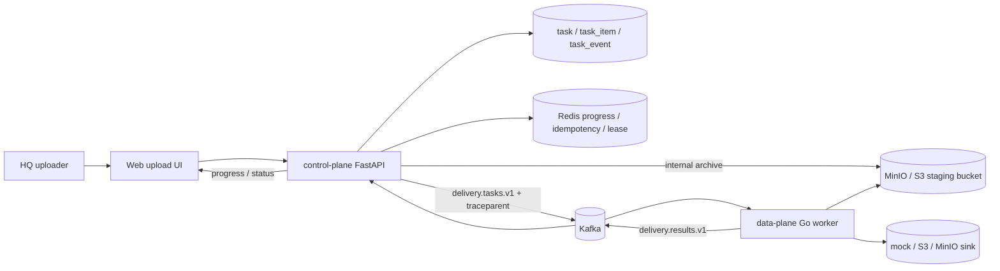
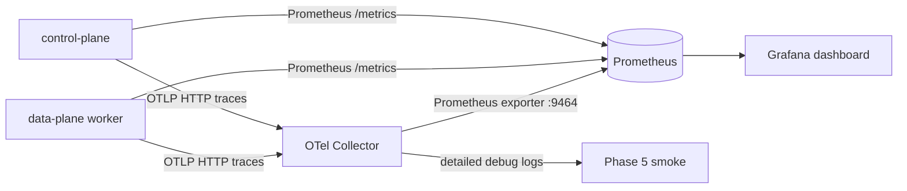

# Architecture

> 当前实现架构说明。产品范围见 [PRD](./PRD.md)，阶段进度见 [ROADMAP](./ROADMAP.md)，方案评审见 [RFC](./RFC/)。

## 目录
- [系统架构图](#系统架构图)
- [可观测拓扑图](#可观测拓扑图)
- [写路径详细时序图](#写路径详细时序图)
- [读路径详细时序图](#读路径详细时序图)
- [关键不变量与一致性边界](#关键不变量与一致性边界)
- [失败模式与恢复策略](#失败模式与恢复策略) — Phase 4 后写

## 当前状态
**v1**：Phase 2 已完成。Go 数据面通过统一 transport 接口支持 file-spool 和 Kafka；本地默认 file-spool，Kafka adapter 已通过 Docker broker 集成测试。当前 sink 支持 mock 与 S3 / MinIO 单段 PUT，结果事件可回写控制面 task / item 状态。

**Phase 3 / 3.x Done**：MySQL 已作为主数据库目标接入本地 compose；source reference 基础链路、Kafka source-reference e2e、GC、幂等、readiness、最小 DLQ 和 review hardening 已完成。HQ 选择文件夹后，control-plane 生成内部 archive 并可暂存到 MinIO / S3 staging bucket，Go worker 可通过 `-source-mode object` 从 staged archive 读取 item bytes。

**Phase 4 Done**：Redis 能力层已完成 compose / 配置基线、control-plane Redis client / health smoke、`ProgressBus` memory / Redis backend 抽象、短 TTL idempotency guard、result apply lease，以及 data-plane Redis fixed-window limiter。`PROGRESS_BACKEND=redis` 时 SSE progress 可通过 Redis pub/sub 跨 control-plane 实例 fanout；`REDIS_IDEMPOTENCY_ENABLED=true` 时 create/upload trigger 会用 Redis claim 挡住正在处理的重复请求；`REDIS_LEASE_ENABLED=true` 时 result consumer 在 apply 前竞争 task 级 lease；`-redis-limiter-enabled` 时 Go worker 在 sink 上传前竞争全局配额。Redis 不替代 Kafka。

**Phase 5 Done**：本地可观测三件套已接入。`deploy/docker-compose.yml` 提供 OTel Collector、Prometheus 和 Grafana；control-plane `/metrics` 暴露 HTTP / task / delivery RED 指标，data-plane `-metrics-enabled` 暴露 task consume、source read、sink upload、result publish 和 limiter RED 指标。control-plane 在 delivery task payload 和 Kafka header 写入 W3C `traceparent`，Go worker 从 payload 恢复 remote parent，并为 task process、source resolve、sink upload、result publish 继续创建 spans。Phase 5 smoke 覆盖 control-plane -> Kafka -> data-plane -> result apply，并验证 collector 日志里的同 trace ID。

**Phase 6 / 6.5 Done**：控制面已落地 dev header / 默认 actor、tenant / app_user / role 基线、task owner tenant/user、仓储层 tenant filter、HQ / 子公司权限边界和最小 task_event actor attribution。Phase 6.5 在此基础上补齐 workspace / physical object / workspace object 元数据、result apply 到读模型映射、子公司只读 API、短 TTL presigned download URL 和最小前端 workspace 页面。

## 系统架构图

当前主链路已经从“控制面本地上传”演进为 control-plane 编排、Kafka durable transport、data-plane 执行、object storage 暂存源文件的跨组件形态：



Phase 6 在 control-plane 入口和 repo/service 层加入 actor、tenant、role 边界，并让 task / task_item / task_event 先带上最小 owner / actor 归属；Phase 6.5 已把子公司读路径落到 workspace / workspace_object 模型。

## 可观测拓扑图

Phase 5 的本地 observability stack 只做最小闭环：应用暴露 metrics，应用向 collector 上报 spans，Grafana 从 Prometheus 读取 dashboard 数据。



`control_plane.delivery.task_publish` 与 `data_plane.task.process/source.resolve/sink.upload/result.publish` 通过 delivery task payload 中的 W3C `traceparent` 共享同一 trace。`control_plane.delivery.result_consume/result_apply` 当前是独立 trace；如果后续需要完整闭环，应在 result message 或 result Kafka header 中继续传递 trace context。

## 写路径详细时序图

当前写路径：

```text
HQ user
  │
  ▼
control-plane FastAPI
  │  POST /tasks/{id}/upload
  │  OBSERVABILITY_ENABLED=true 时创建 HTTP / delivery spans
  │  METRICS_ENABLED=true 时记录 HTTP / task / delivery RED 指标
  │
  ├─ delivery_backend=python
  │    └─ 保留 Phase 1 Python 直传路径
  │
  └─ delivery_backend=go-worker
       │
       ├─ 查询 task / task_item
       ├─ 过滤 upload_status=pending 且 severity=ok/warning 的 item
       ├─ 构建 DeliveryTaskMessage
       ├─ 注入 W3C traceparent
       ├─ delivery_source_mode=file:
       │    └─ 消息携带 temp_dir + src_path（本地兼容路径）
       ├─ delivery_source_mode=object:
       │    ├─ uploaded folder -> internal archive -> staging object storage
       │    └─ 消息携带 source reference + source_path
       ├─ delivery_transport=file:
       │    └─ 写入 /tmp/auto_upload_outbox/delivery.tasks.v1/{task_id}.json
       ├─ delivery_transport=kafka:
       │    └─ publish delivery.tasks.v1 + traceparent header
       └─ task.status -> queued

Go data-plane worker
  │
  ├─ file-spool / Kafka transport 读取 delivery.tasks.v1
  ├─ transport decode -> DeliveryTask
  ├─ 从 DeliveryTask.traceparent 恢复 trace context
  ├─ 记录 consume / source / sink / result RED 指标
  ├─ pipeline.ProcessTask
  │    ├─ source-mode=file: FileSource(temp_dir, src_path)
  │    ├─ source-mode=object: S3 staged archive -> source_path
  │    └─ Sink.Upload（mock 或 S3/MinIO 单段 PUT）
  └─ file-spool / Kafka transport 写入 delivery.results.v1

control-plane result consumer
  │
  ├─ 读取 delivery.results.v1
  ├─ REDIS_LEASE_ENABLED=true: 竞争 delivery_result_apply:{task_id} lease
  ├─ apply_delivery_result()
  ├─ 回写 task / task_item 状态
  └─ uploaded item + receipt key -> physical_object / workspace_object
```

后续目标：
- 为 S3 / MinIO sink 补 multipart、resume 和平台层 dedup。

## 读路径详细时序图

```text
Subsidiary user
  │
  ▼
web/public/workspaces.html
  │  X-Actor-Tenant / X-Actor-User / X-Actor-Role
  ▼
control-plane FastAPI
  │
  ├─ GET /api/v1/workspaces
  │    └─ WorkspaceRepo: target_tenant_id == actor.tenant_id
  ├─ GET /api/v1/workspaces/{workspace_id}/objects
  │    └─ WorkspaceObject + PhysicalObject join，继续校验 workspace target tenant
  └─ POST /api/v1/workspace-objects/{object_id}/download-url
       ├─ 权限检查通过后才调用 S3 / MinIO presign
       ├─ 返回短 TTL URL，浏览器直连 sink 下载
       └─ 记录 workspace_object_download_url_issued task_event
```

HQ actor 读取 workspace 时使用 `workspace.owner_tenant_id == actor.tenant_id`；子公司 actor 使用 `workspace.target_tenant_id == actor.tenant_id`。越权访问不暴露资源存在性，统一返回 404。

## 关键不变量与一致性边界

- `workspace.target_key` 对应分类结果中的 `task_item.target_name_matched`；result apply 不重新读取 profile。
- `workspace_object.task_item_id` 唯一，重复 delivery result apply 不会重复生成同一逻辑文件。
- `physical_object` 在 Phase 6.5 只是 sink receipt 元数据；不做 dedup 命中、refcount GC 或跨 workspace 合并。
- presigned URL helper 只能在 workspace/object 权限检查成功后调用；测试覆盖未授权 actor 不触发 presign。
- 下载 URL 签发审计暂落来源 `task_event`；完整 `audit_log` 表留 Phase 7。
- 在真实负载下补 worker 并发调度、backpressure 和重试策略。
